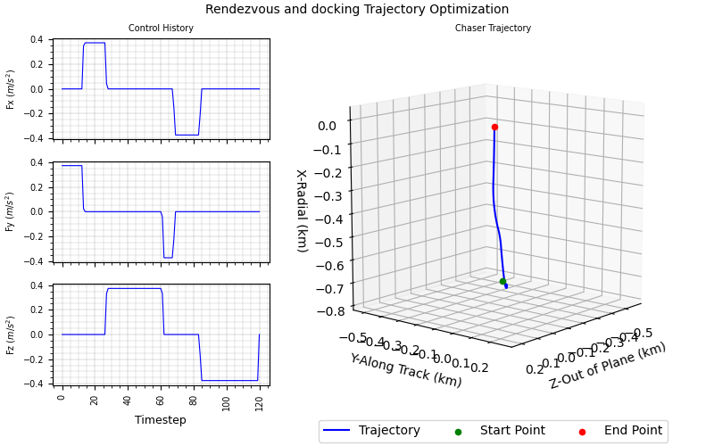

# Rendezvous and docking trajectory optimization
> Program implemented to compute optimal solution for the rendezvous  trajectory problem using convex optimization.   

## Table of contents
* [General info](#general-info)
* [Screenshots](#screenshots)
* [Setup](#setup)
* [How to run ](#how)
* [Updates](#updates)
* [To-do list](#to-do)

## Screenshots
Optimal trajectory generated by the script for [SPADEX](https://www.isro.gov.in/mission_SpaDeX.html) mission as a test case.   
### Trajectory in 3D   

      

## General info
Implemented Rendezvous and docking trajectory optimization problem
based on the paper using convex optimization techniques:    

Probabilistic Trajectory Optimization Under Uncertain Path Constraints for Close Proximity Operations     
JOURNAL OF GUIDANCE, CONTROL, AND DYNAMICS    
Christopher Jewison and David W. Miller     
Massachusetts Institute of Technology, Cambridge, Massachusetts 02139.      
***   

&nbsp;         
This system assumes a circular orbit of the target, as do the linear dynamics in this frame. In the Clohessy–Wiltshire–Hill (CWH), the relative translational motion of the chaser spacecraft with respect to the target can be defined by the CWH equations as     

   
   
where m is the mass of the chaser spacecraft; Fx, Fy and Fz are thrust forces applied by the chaser spacecraft; n = sqrt( μ∕r3) is the mean motion of the target satellite; and r0 is the radius of the target’s
circular orbit.
&nbsp;    
The Clohessy–Wiltshire–Hill (CWH) frame is centered on the target spacecraft, with the i^ direction pointing radially outward from the Earth; the j^ direction pointing in the intrack, orbital velocity direction of the target satellite; and the k^ direction pointing in the crosstrack direction, out of the orbital plane, to complete the orthogonal set. This system assumes a circular orbit of the target, as do the linear dynamics in this frame.
&nbsp;    
Additionally, because the dynamics will eventually need to be implemented in discrete time for the trajectory optimization process, the discrete-time version of these
dynamics is x(k+1) =  Ad @ x(k) + Bd @ u(k)   - (3)
where k is the current time step, T is the discretization time or time
between steps k and k + 1.    
&nbsp;    
The rendezvous trajectory problem can be formulated as a prioritized optimization problem as
follows.

   

where Ad and Bd matrix is given by     

   
&nbsp;    

### Input Data    
Chaser (SDX01) and Target (SDX02) state vectors are derived using the TLEs.  

SDX01                   
1 62459U 24253A   25007.29615164  .00010751  00000+0  35525-3 0  9996     
2 62459  54.9972 223.7291 0008088 313.4583  46.5768 15.31925325  1161      
&nbsp;    
SDX02                   
1 62460U 24253B   25007.62238957  .00009572  00000+0  31751-3 0  9992     
2 62460  54.9967 222.2754 0008152 314.6307  45.4052 15.31933703  1213    
   
&nbsp;    
#### Remember this is a target centered coordinate frame and the chaser state vectors should be in relative to target

&nbsp;     
### Convex Optimization    

Python library CVXPY [ https://www.cvxpy.org/ ] used for optimization,       
Used CLARABEL solver for this problem.     

## Setup
Script is written with python (Version: 3.6) on linux. Additional modules required :   

* numpy  (tested with Version: 1.18.4 )
* matplotlib  (tested with Version: 2.1.1 )
* CVXPY (tested with Version: 1.6)

## How to run   
* Verify and install required modules 
* run `python rendezvous_optimizer.py`. 

## Updates   
*   
*   *  

## To-do list
* 

